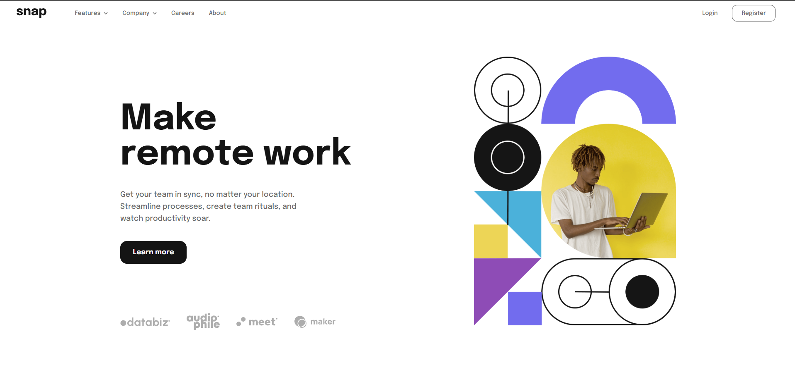
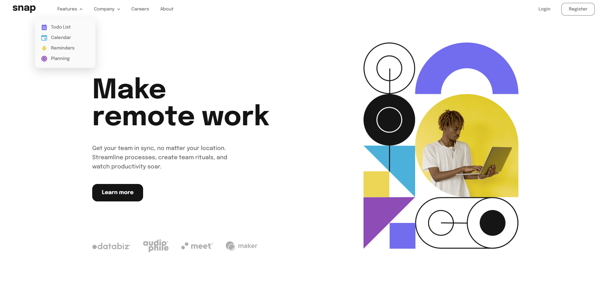
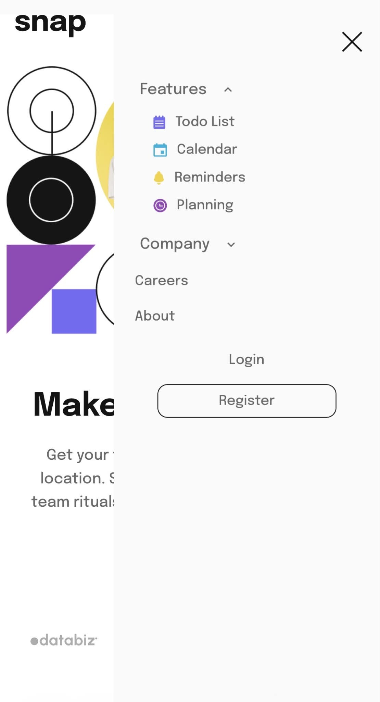

# Frontend Mentor - Intro section with dropdown navigation solution

This is a solution to the [Intro section with dropdown navigation challenge on Frontend Mentor](https://www.frontendmentor.io/challenges/intro-section-with-dropdown-navigation-ryaPetHE5). Frontend Mentor challenges help you improve your coding skills by building realistic projects. 

## Table of contents

- [Overview](#overview)
  - [The challenge](#the-challenge)
  - [Screenshot](#screenshot)
  - [Links](#links)
- [My process](#my-process)
  - [Built with](#built-with)
  - [What I learned](#what-i-learned)
  - [Continued development](#continued-development)
  - [Useful resources](#useful-resources)
- [Author](#author)

## Overview

### The challenge

Users should be able to:

- View the relevant dropdown menus on desktop and mobile when interacting with the navigation links
- View the optimal layout for the content depending on their device's screen size
- See hover states for all interactive elements on the page

### Screenshot






### Links

- Solution URL: (https://www.frontendmentor.io/solutions/intro-section-with-dropdown-navigation-w_rHUFta0i)
- Live Site URL: (https://intro-section-with-dropdown-drab.vercel.app/)

## My process

### Built with

- Semantic HTML5 markup
- CSS custom properties
- Flexbox
- Mobile-first workflow

### What I learned

I'm proud of getting the nav-bar and nav-menu to work and look as intended even with the dropdown buttons. It did take a lot of time fiddling with the padding and spacing to get it to look like the design but I am happy with the end result. I really liked the challenge on how to get the dropdown buttons to close when clicking or pressing on another one. I used the following code in JavaScript to make this happen.

```js
dropdownButtons.forEach(function(button)
{
    button.addEventListener("click", function()
    {
        const dropdown = button.closest(".dropdown");
        const dropdownMenu = dropdown.querySelector(".dropdown-menu");
        const arrow = button.querySelector("img");

        const isOpen = dropdownMenu.classList.contains("active");

        dropdownButtons.forEach(function(otherButton)
    {
        const otherDropdown = otherButton.closest(".dropdown");
        const otherMenu = otherDropdown.querySelector(".dropdown-menu");
        const otherArrow = otherButton.querySelector("img");

        otherMenu.classList.remove("active");
        otherArrow.src = "./images/icon-arrow-down.svg"

    });

        if (!isOpen)
        {
            dropdownMenu.classList.add("active");
            arrow.src = "./images/icon-arrow-up.svg";
        }
    });
});
```

### Continued development

I need to becareful with the tablet design layouts. It seems that my devices are too big and when using the tablet to test layouts they become a bit all over the place. This gets confusing as well when trying to get the layouts as close as possible. There are still some areas for tablet layout that I need to work on and I will continue to improve in future challenges.

### Useful resources

- StackOverflow has still been my go to resource for help especially when it came to the navbar and navigation layouts.

## Author

- Frontend Mentor - [@khriz93](https://www.frontendmentor.io/profile/Khriz93)
